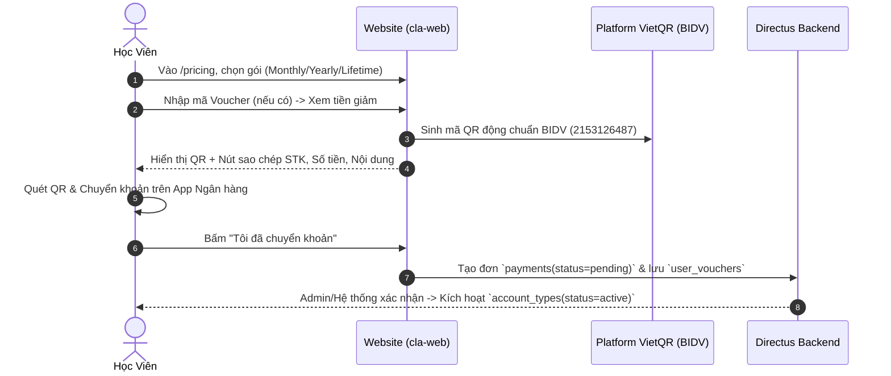

# HƯỚNG DẪN QUẢN LÝ GÓI CƯỚC, THANH TOÁN VIETQR, VOUCHER & AFFILIATE

Tài liệu này hướng dẫn Quản trị viên và Giáo viên cách vận hành hệ thống **Gói cước**, **Thanh toán VietQR**, **Tạo mã giảm giá (Voucher)** và **Đối soát hoa hồng Affiliate / Seeder** trực tiếp trên Directus (`https://marutek.space`).

---

## 1. Cấu Trúc Các Bảng Trên Directus

| Collection | Chức năng | Đối tượng sử dụng |
| :--- | :--- | :--- |
| **`account_plans`** | Danh sách các gói cước (`Free`, `Monthly`, `Yearly`, `Lifetime`) | Admin cấu hình giá, quyền lợi, số ngày |
| **`vouchers`** | Danh sách mã giảm giá do Admin/Giáo viên/Seeder tạo | Giáo viên, Seeder, Admin |
| **`payments`** | Danh sách các đơn thanh toán VietQR & Mobile | Hệ thống tự ghi nhận, Admin đối soát |
| **`user_vouchers`** | Lịch sử học viên đã dùng voucher nào, cho đơn nào | Hệ thống ghi nhận, dùng để tính hoa hồng |
| **`account_types`** | Trạng thái gói cước thực tế của học viên (`active`, `expired`) | Hệ thống & Admin kích hoạt |

---

## 2. Hướng Dẫn Giáo Viên Tạo Voucher Mới (Trong 30 Giây)

1. Đăng nhập vào **Directus Admin** ➡️ Chọn mục **`vouchers`** ở thanh menu bên trái.
2. Bấm nút **"+" (Tạo mới)** ở góc trên bên phải.
3. Điền các trường thông tin:
   * **Tên voucher (`name`)**: Tên chương trình (VD: `Khuyến mãi 20% Thầy Nam`).
   * **Mã code (`code`)**: Mã học viên nhập khi thanh toán (VD: `THAYNAM20` - nên viết hoa không dấu).
   * **Giá trị giảm (`value`)**: Nhập số (VD: `20` nếu giảm 20%, hoặc `50000` nếu giảm 50.000đ).
   * **Loại giảm (`is_percent`)**:
     * **Bật (ON)**: Giảm theo phần trăm (%).
     * **Tắt (OFF)**: Giảm số tiền VND cố định.
   * **Thời hạn (`valid_from` - `valid_until`)**: Chọn ngày bắt đầu và ngày kết thúc.
   * **Giới hạn số lượt (`max_uses`)**: Ví dụ `100` (để trống nếu không giới hạn).
   * **Tên Seeder / Đối tác (`owner_name`)**: Tên người sở hữu mã để tính hoa hồng (VD: `Thầy Nam`).
   * **% Hoa hồng (`commission_percent`)**: Ví dụ `15` (15% trên số tiền thực thu).
   * **Trạng thái (`status`)**: Chọn `Published` để mã hoạt động ngay.
4. Bấm **Lưu (Save)**.

---

## 3. Quy Trình Thanh Toán VietQR Trên Website

### Thông Tin Ngân Hàng Tích Hợp:
* **Ngân hàng**: BIDV - Ngân hàng TMCP Đầu tư và Phát triển Việt Nam (Mã BIN: `970418`)
* **Số tài khoản**: `2153126487`
* **Chủ tài khoản**: `HOANG THI THANH HA`
* **Cú pháp chuyển khoản**: Email đăng ký của học viên hoặc `CLA <Mã_Đơn>`.

---

## 4. Cách Thiết Lập Dashboard / Biểu Đồ Phân Tích (Directus Insights)

Để theo dõi hiệu quả voucher và tính tiền cho Seeder ngay trên Directus:

1. Vào menu **Insights** trên thanh bên Directus (Biểu tượng biểu đồ) ➡️ Bấm **Create Dashboard** (Đặt tên: `Thống kê Doanh thu & Affiliate`).
2. Bấm **Add Panel** để tạo các biểu đồ:
   * **Biểu đồ 1: Số đơn theo Voucher (Bar Chart / Metric)**:
     * Collection: `payments`
     * Metric: `Count of ID`
     * Group by: `voucher_id`
   * **Biểu đồ 2: Tổng Doanh thu theo Gói (Pie Chart)**:
     * Collection: `payments`
     * Function: `Sum of amount_vnd`
     * Group by: `plan_id`
     * Filter: `status = verified`
   * **Bảng 3: Danh sách Học viên dùng Voucher (Table Panel)**:
     * Collection: `user_vouchers`
     * Hiển thị các cột: `date_created`, `user_id`, `voucher_id`, `payment_id`.
     * 👉 Dựa vào bảng này để đối soát và chuyển khoản hoa hồng cho từng Seeder.

---

## 5. Quản Lý Gói Cước Mobile (RevenueCat)

* Hệ thống `account_types` trên Directus hỗ trợ cả `source = "vietqr"` (web) và `source = "revenuecat"` (mobile).
* Khi học viên mua qua ứng dụng di động iOS / Android, ứng dụng mobile chỉ cần cập nhật dòng trong bảng `account_types`:
  * `user_id`: ID của học viên.
  * `type`: Tên gói (`Monthly`, `Yearly`, `Lifetime`).
  * `source`: `revenuecat`.
  * `status`: `active`.
  * `expired_time`: Ngày hết hạn tương ứng.
* Web và Mobile dùng chung hàm kiểm tra quyền `isPremium`, đảm bảo học viên mua trên điện thoại thì khi đăng nhập vào Web vẫn dùng được toàn bộ tính năng Premium!
