# Kiến trúc dữ liệu — cla-web

> Sơ đồ thuần **data movement**: dữ liệu chảy từ đâu → đâu, qua tầng nào.
> Không mô tả logic nghiệp vụ (điều kiện rẽ nhánh) — xem `docs/premium-directus-contract.md` cho contract premium.

---

## 1. Bức tranh tổng thể (System Context)

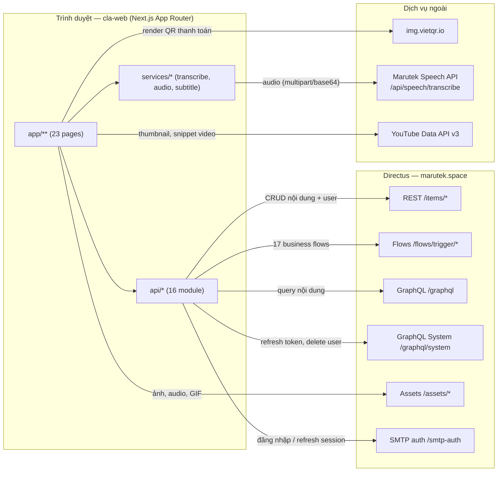

---

## 2. Bản đồ Routes (App Router)

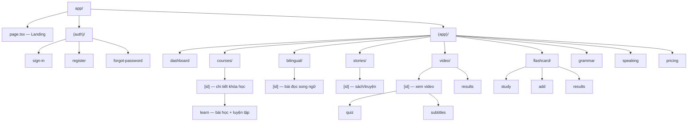

---

## 3. Luồng dữ liệu phân lớp

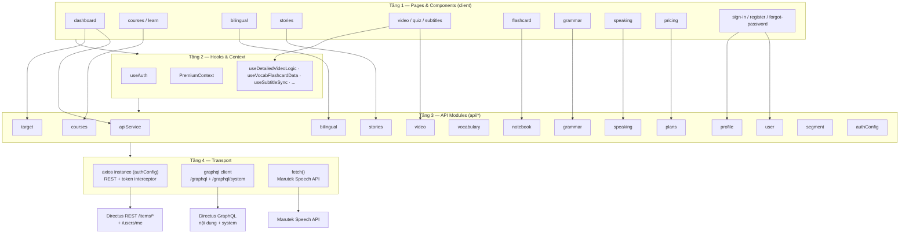

---

## 4. Sequence — các luồng dữ liệu chính

> Toàn bộ tuyến tính, chỉ thể hiện đường đi của dữ liệu.

### 4.1. Xác thực & phiên đăng nhập

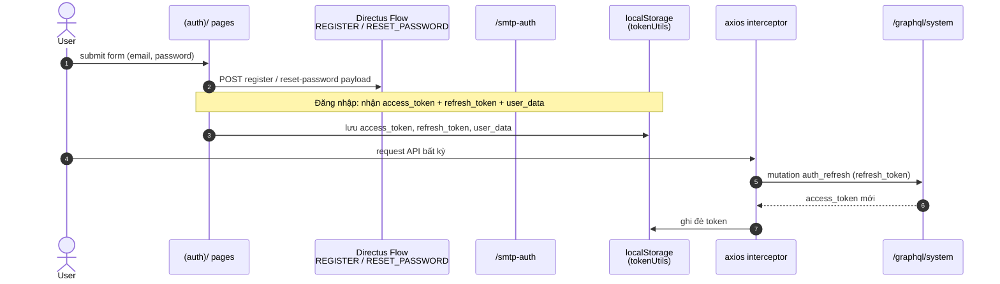

### 4.2. Khóa học & luyện tập

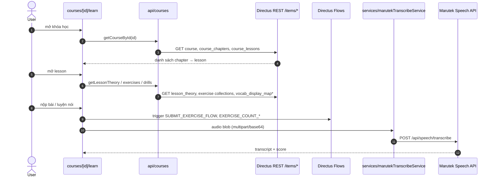

### 4.3. Đọc song ngữ & truyện

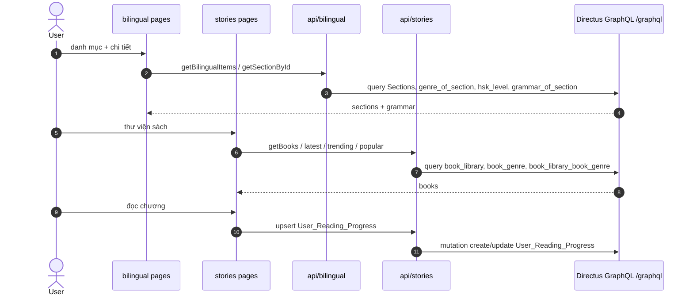

### 4.4. Video & phụ đề AI

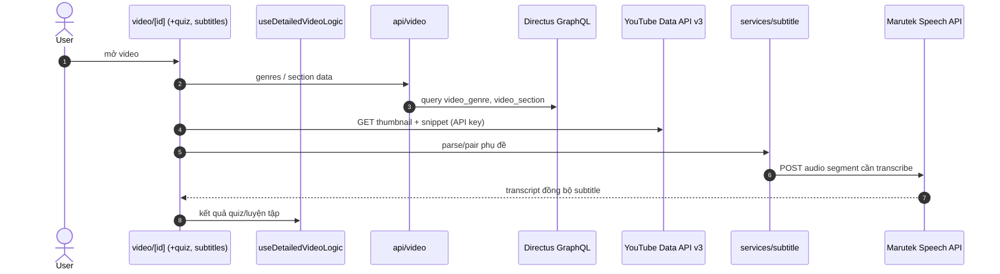

### 4.5. Flashcard & sổ tay từ vựng

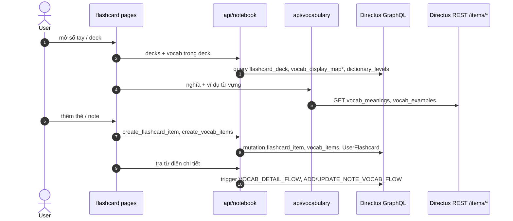

### 4.6. Trạng thái Premium

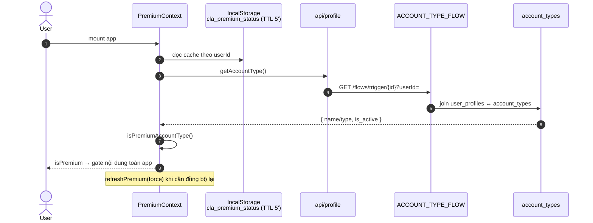

### 4.7. Thanh toán Premium (VietQR)

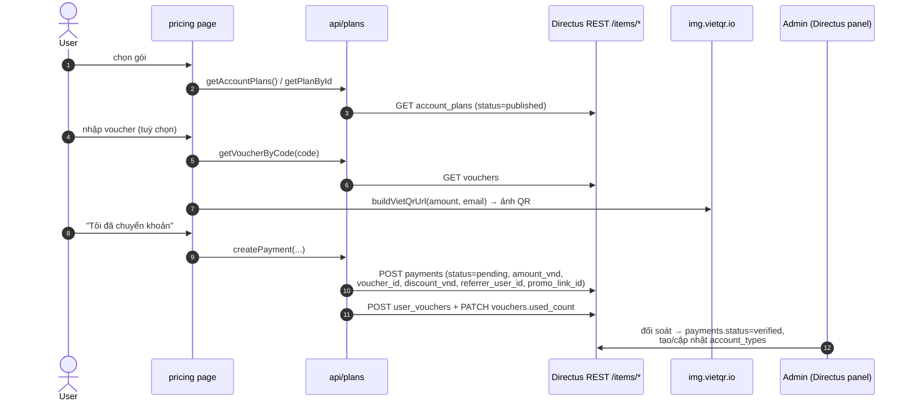

### 4.8. Hồ sơ & mục tiêu học tập

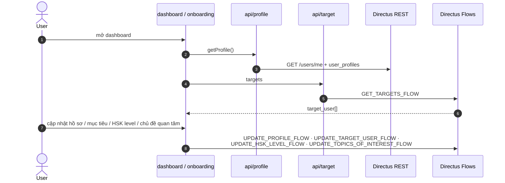

---

## 5. Bảng mapping Module → Backend

| Module (`api/*`) | Transport | Collection / Endpoint | Page sử dụng |
| :-- | :-- | :-- | :-- |
| `apiService` | GraphQL + REST | `Sections`, `vocab_*`, `topic_of_exercise`, `link_exercise`; `/users/me`, `user_profiles` | dashboard |
| `courses` | REST | `course`, `course_chapters`, `course_lessons`, `lesson_theory`, `banners`, `vocab_display_map*` | courses, learn |
| `bilingual` | GraphQL | `Sections`, `genre_of_section`, `hsk_level`, `grammar_of_section`, `video_section` | bilingual |
| `stories` | GraphQL | `book_library`, `book_genre`, `book_library_book_genre`, `User_Reading_Progress` | stories |
| `video` | GraphQL | `video_genre`, `video_section` | video, quiz, subtitles |
| `notebook` | GraphQL | `flashcard_deck`, `flashcard_item`, `UserFlashcard`, `vocab_items`, `dictionary_levels` | flashcard |
| `vocabulary` | REST | `vocab_meanings`, `vocab_examples`, `lesson_theory`, `vocab_display_map_vocab_items` | flashcard, learn |
| `grammar` | GraphQL | `grammar_modules`, `grammar_item` | grammar |
| `speaking` | GraphQL | `speaking_topics`, `speaking_scenarios`, `speaking_dialogues` | speaking |
| `target` | GraphQL + Flow | `target_user`, `GET_TARGETS_FLOW`, `UPDATE_TARGET_USER_FLOW` | dashboard, onboarding |
| `profile` | REST + Flow | `user_profiles`, `ACCOUNT_TYPE_FLOW`, `UPDATE_PROFILE_FLOW` | dashboard, settings |
| `user` | GraphQL System | `delete_users` (system mutation) | settings |
| `plans` | REST | `account_plans`, `payments`, `vouchers`, `user_vouchers`, `account_types` | pricing |
| `segment` | Service | phân tách câu/từ (phục vụ subtitle/flashcard) | subtitles, flashcard |
| `authConfig` | Axios + GraphQL System | token interceptor, `auth_refresh` | toàn app |

## 6. Danh mục Directus Flows đang dùng

| Flow | Mục đích dữ liệu |
| :-- | :-- |
| `REGISTER_FLOW` | tạo tài khoản mới |
| `ONBOARDING_EMAIL_CHECK_FLOW` | kiểm tra email tồn tại |
| `RESET_PASSWORD_FLOW` | đặt lại mật khẩu |
| `ACCOUNT_TYPE_FLOW` | đọc trạng thái premium |
| `UPDATE_PROFILE_FLOW` | cập nhật hồ sơ |
| `GET_TARGETS_FLOW` / `UPDATE_TARGET_USER_FLOW` | đọc/ghi mục tiêu học |
| `UPDATE_TOPICS_OF_INTEREST_FLOW` | chủ đề quan tâm |
| `UPDATE_HSK_LEVEL_FLOW` | trình độ HSK |
| `SUBMIT_EXERCISE_FLOW` | nộp bài luyện tập |
| `EXERCISE_BY_ID_FLOW` | lấy đề bài |
| `EXERCISE_COUNT_BY_TOPIC_FLOW` / `..._BY_LESSON_AND_TOPIC_FLOW` | đếm số bài đã làm |
| `VOCAB_DETAIL_FLOW` | chi tiết từ điển |
| `ADD_NOTE_TO_VOCAB_FLOW` / `UPDATE_NOTE_VOCAB_FLOW` | ghi chú từ vựng |
| `FLASHCARD_DECK_VOCABS_FLOW` | từ vựng trong deck |

## 7. Dịch vụ ngoài

| Dịch vụ | Endpoint | Dữ liệu trao đổi |
| :-- | :-- | :-- |
| VietQR | `img.vietqr.io/image/...` | URL build từ `lib/payment.ts` → ảnh QR (amount + content) |
| Marutek Speech | `/api/speech/transcribe` (+`/base64`) | audio blob/base64 → transcript (zh-CN) |
| YouTube Data API v3 | `googleapis.com/youtube/v3` | thumbnail + metadata video |

---

*Cập nhật lần cuối: 2026-08-26 — sinh tự động từ audit codebase.*
